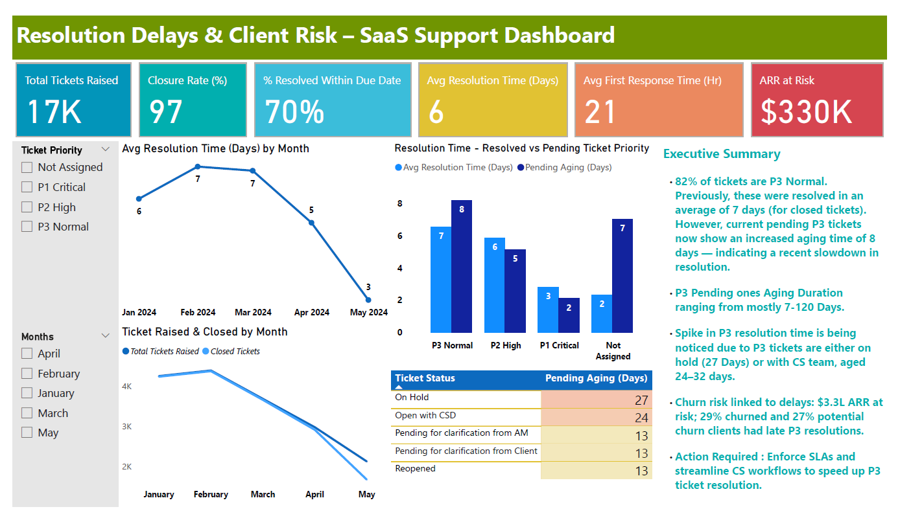

# SaaS Support Ticket Analytics

<h3 align="center"><strong></strong></h3>

  

## 📍 **THE PROBLEM :**
The core problem identified is that currently **pending P3 Normal priority tickets** are taking **longer to resolve** compared to similar P3 tickets that were resolved in the past. This is unusual, as the current workflow should ideally support **quicker resolution over time**, not delays.

More importantly, this **delay in resolution is strongly linked to churn risk**. A significant number of **churned clients** experienced **prolonged resolution times** for their P3 Normal tickets, and a **similar pattern is now emerging** among **potential churn clients**, where their **open P3 tickets are also seeing extended delays**.

Given that **82% of all tickets received by Company A fall under the P3 Normal category**, they are often **deprioritized or overlooked**. While individually these tickets may seem less urgent, the **high volume creates a compounding effect**, potentially leading to **deteriorating customer satisfaction** and **increased churn risk** if not addressed proactively.

## 🎯 **OBJECTIVE :**
The objective of this analysis is to **identify the root causes behind delays** in resolving **P3 Normal priority tickets** and evaluate their **impact on client churn risk and satisfaction**.

By understanding **resolution patterns**, **team-level performance**, and **client ticket history**, the goal is to provide **data-driven recommendations** to improve support operations and **proactively mitigate potential churn**, especially among **high ARR clients**.

## 🛠️ **APPROACH :**

**Segmented tickets** based on status (Open vs. Resolved), priority (P3 Normal), and client type (Churned, Potential Churn, Non-Churned)
**Compared resolution timelines** of current pending P3 tickets with historical resolved P3 tickets to detect unusual delays
**Analyzed ticket transitions**, **team-level ownership**, and delay contributors to identify bottlenecks
**Mapped resolution timelines against churn outcomes** to uncover correlation patterns
**Flagged high-ARR clients** with delayed P3 tickets for prioritization

## ✅ **OUTCOME :**

**P3 Normal tickets currently show longer resolution times** compared to past resolved tickets, especially for **potential churn clients**
**29% of churned clients** had **unresolved or overdue P3 tickets** — indicating a strong link between **delay and churn**
A similar **27% delay pattern is now visible among potential churn clients**, highlighting an urgent need for **intervention**
**82% of total tickets** are P3 Normal, contributing to systemic delays due to sheer volume
**Actionable recommendations** were provided to improve ticket triaging, optimize workflows, and **reduce resolution delays** that impact client satisfaction and retention
